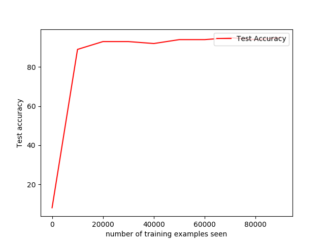
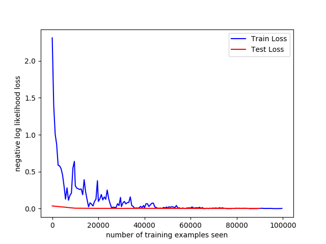
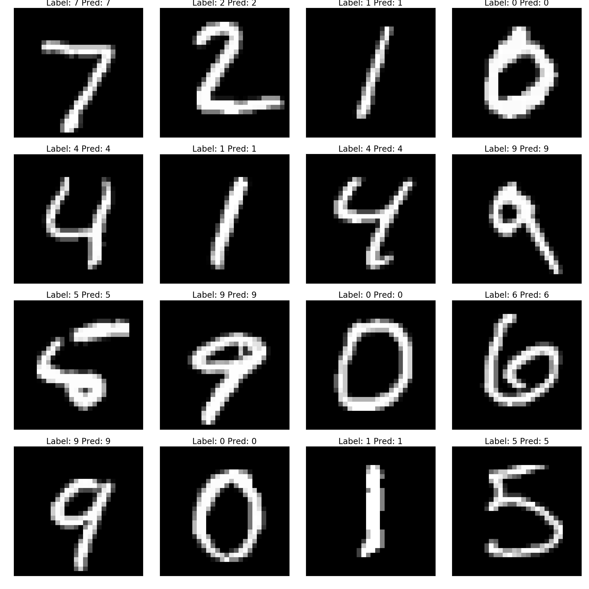
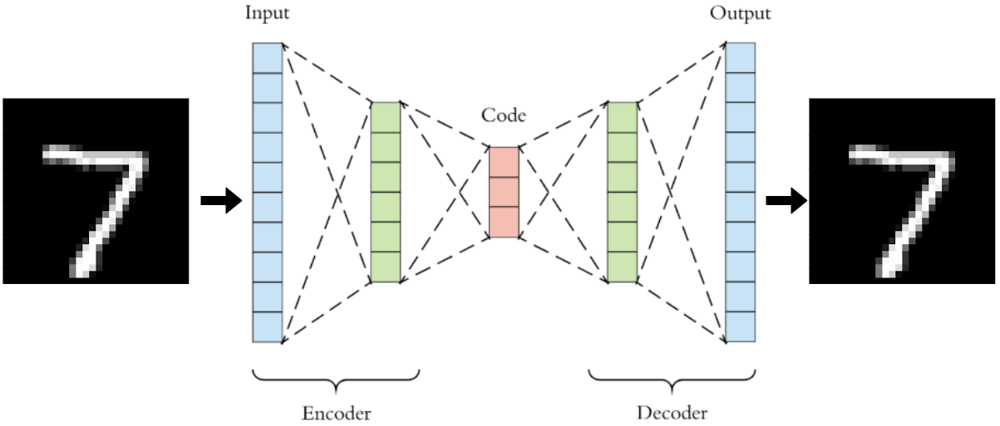
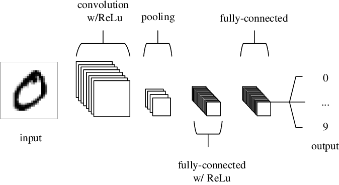
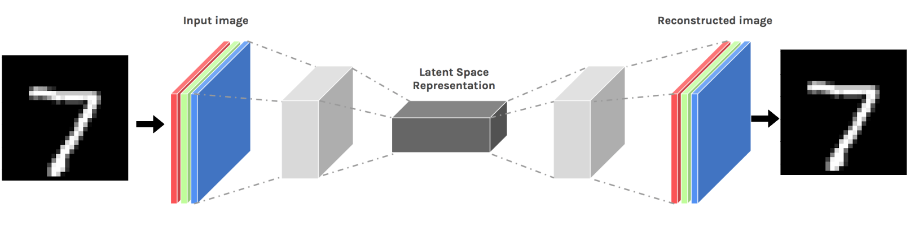

# Computer Vision T School Labs

There are a total of two labs for this year's computer vision T school. The focus of the labs are to get everyone familiar with training deep learning neural networks on a few simple problems ie, classification, auto-encoding.  

## Table of Contents :

-  [Installation](#installation)
-  [Lab 1](#Lab_1)
	*  [Fully Connected Classifier](#Fully_Connected_Classifier)
    *  [Fully Connected AutoEncoder](#Fully_Connected_Autoencoder)
-  [Lab 2](#Lab_2)
	*  [Convolutional Classifier](#Convolutional_Classifier)
    *  [Convolutional AutoEncoder](#Convolutional_Autoencoder)


## Installation 

To get started:  
1. clone this repo in your local machine. Preferably you should have ssh setup on your machine already.

    `git clone git@github.ibm.com:Edward-Li/Computer_Vision_TSchool.git`

2. Create a virtual environment at a location of your choice if you haven't already:
    
    ```
    python3 -m venv --system-site-packages ./<venv_name>
    source ./venv/bin/activate  # sh, bash, or zsh
    pip install --upgrade pip
    ```

3. Install requirements from the requirements file after cd into the project folder:

    `pip install requirements.txt`
    
     Requirements:
   
      *  numpy  
      *  torch==1.7.0  
      *  torchvision=0.7.0  
      *  opencv-python==4.4.0.42
      *  matplotlib
   
You should be good to go now. 

## Lab 1 

Lab 1 focuses on getting you familiar with the training loop of a deep learning neural network using some fully connected layers to build a classifier for classifying mnist digits and an autoencoder for reconstructing a mnist digits image. This lab will teach you how to write a data loader, how to create a model and forward/backward through it. How to propagate losses, how to store checkpoints and how to log variables and images/visualizations to monitor progress.

### Fully Coonnected Classifier

This part of the lab is more of a demonstration. `cd` into the `lab1_classifier` folder. In here are three files:

```
data.py
train.py
model.py
```

understand the logic of the the `train.py` and run training by calling `python train.py` with parameters. Feel free to make changes to any parts of the code if it improves your training. 

Tasks:
1. Run training successfully with the existing model and training loop, ensure we have some results and checkpoints in the `output` directory.
Once the training is done you should get a few figures that look like this:
   
Accuracy:  


Losses:  


Visualization:  


2. Without using convolutions layers, try to improve the fully connected classifier model. 

3. When done, summarize your findings and what you changed to improve the accuracy. 


### Fully connected AutoEncoder 

This part of the lab focuses on more hands on implementation of a fully connected autoencoder to reconstruct mnist images.


The code is in the `lab1_autoencoder` folder and most of the code stays the same. 

Most of the training loop remains the same, there are a few modifications that will require you to implement. 

Tasks:

1. Implement the model architecture and forward pass for the fully connected auto encoder. Once again do not use any convolutions. 

2. Select an appropriate loss function and use it in `my_loss_fn()`. Explain why you used this loss function. 

3. Implement either Peak-to-peak signal to noise ratio (PSNR) or Structure Similarity Index (SSIM) in pytorch/numpy in `calculate_psnr()` change the function name as necessary. Plot how this metric improves over time. 

4. Implement a custom visualization for this task in `eval()`, can you either matplotib or opencv, whichever is easier.  

5. Modify the training loop and data ingestion etc as necessary for training this network. 

6. Select and add appropriate augmentations to the data loader. 

Finally, when the tasks are completed, summarize your findings and explain your decisions. 


## Lab 2

Lab 2 focuses on solving the same problems from lab 1 but using convolutional neural networks. 

### Convolutional Classifier

This part of the lab builds from lab 1's classifier. This time, instead of using a fully connected neural network, we are going to use convolutional neural networks and explore its performance. 



Code for this part is in `lab2_classifier` folder and most of the code should be familiar. 

Tasks:

1. Implement the model architecture and forward pass for the convolutional classifier. 

2. In additional to accuracy, calculate and plot per class metrics including f1 score, precision, recall, accuracy. 

3. Create additional visualizations for the above mentioned metrics and any other visuals/info for understanding classifier performance. 

Finally, when the tasks are completed, summarize your findings and explain your decisions. 


### Convolutional AutoEncoder 

This part of the lab builds from lab 2's auto encoder. This time, we will build a convolutional auto encoder. such as :



Code for this part is in `lab2_autoencoder` folder and most of the code should be familiar. 

Tasks:

1. Implement the model architecture and forward pass for the convolution auto encoder.

2. Select an appropriate loss function and use it in `my_loss_fn()`. Explain why you used this loss function. Can use the same one from lab 1 that you used previously.

3. Implement either Peak-to-peak signal to noise ratio (PSNR) and Structure Similarity Index (SSIM) in pytorch/numpy in `calculate_psnr()/calculate_ssim()`. Plot how this metric improves over time. Can reuse implmentation from lab 1. 

4. Implement a custom visualization for this task in `eval()`, can you either matplotib or opencv, whichever is easier.  Can use same one as implemented in lab 1. 

5. Choose one of the following 2 tasks to do, big bonus if you can do both. 

   -  **CHOICE 1**: Create a plot of the latent distribution of the neural network and store this image across time. What happens when you sample a latent point and try to decode it ?
      
   -  **CHOICE 2**: If we want to adopt this network to denoise or upsample the image instead. What modifications do we need and how do we test it's effectiveness.
      *  Pick one of the two problems and implement any changes needed.  
      *  Create a new sub folder and modify any code needed to solve for this task. 
      *  Create any additional visualizations to help understand task effectiveness. 

Finally, when the tasks are completed, summarize your findings and explain your decisions. 

